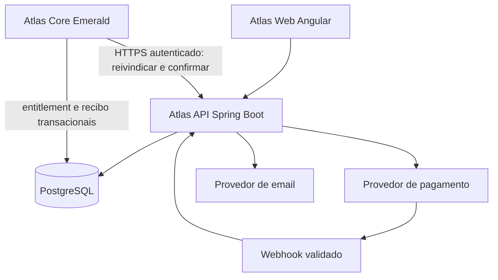

# Sprint Backend — Conta, Loja e Administração Atlas

Data: 02/10/2026. Status: M1 implementado localmente; M2 integrado ao Netlify/SMTP; M3 implementado e validado; M4 implementado, testado e instalado. Ambiente público gratuito de desenvolvimento, sem liberação de vendas.

Objetivo: substituir os mocks do Atlas Web por uma API persistente, validar permissões no servidor e completar cadastro → vínculo Minecraft → catálogo → pedido → pagamento confirmado → entrega → expiração VIP. A entrega termina com operação monitorada, recuperação testada e aceite em homologação; habilitar vendas depende dos critérios comerciais e operacionais.

Este é um backlog completo com marcos sequenciais, não uma promessa de concluir pagamento, infraestrutura e integração Minecraft em uma única semana. Executar em iterações curtas; estimar datas após a fundação e escolha do provedor. Não iniciar alterações no servidor de jogo apenas por este planejamento.

## 1. Ponto de partida verificado

- `atlas-api/` possui fundação M1 e autenticação M2; detalhes e pendências em [M1-BACKEND.md](M1-BACKEND.md) e [M2-BACKEND.md](M2-BACKEND.md).
- `atlas-web` usa Angular 22, services mockados, sessão temporária, USER/ADMIN, loja, promoções e compras simuladas. Os 28 testes atuais validam a experiência mockada; não comprovam segurança ou integração real.
- O Core compila para Java 21 e já possui PostgreSQL, autenticação Premium/Offline, players, ranks, permissões e kits/cooldowns.
- Migrations existentes: `008_auth.sql`, `009_sessions.sql`, `010_crates.sql`, `011_player_keys.sql`, `013_crate_open_history.sql`, `014_store_orders.sql`, `015_vips.sql`; a sequência consultada chega a `032_staff_notes.sql`.
- As tabelas de loja existentes não comprovam fluxo comercial. `store_orders` tem somente flag de entrega, e VIPs usam timestamps sem fuso e ainda precisam de integração com expiração e benefícios efetivos.
- Benefícios de kits, homes, claims, fly e ender chest hoje consultam ranks. Entitlement VIP deve ser integrado nesses pontos sem substituir o cargo de staff.
- Frontend público atualmente no Netlify. A API precisa de hospedagem, HTTPS e configuração de origem próprios; Minecraft não deve ser exposto como servidor HTTP público.
- Catálogo inicial: VIP 1 = R$ 25,00; VIP 2 = R$ 35,00; VIP 3 = R$ 50,00, por 30 dias. Categorias: VIPs, Chaves, Pacotes, Cosméticos. Caixa não será outra categoria da loja.

Referências locais: [LOJA.md](LOJA.md), [LOJA-BACKEND.md](LOJA-BACKEND.md), [AGENTS.md](AGENTS.md). Este documento detalha a execução da proposta anterior e prevalece para a organização atual das categorias.

## 2. Escopo e decisões

### Incluído na primeira entrega

- Conta web independente, cadastro/login/logout, recuperação de senha e confirmação de email.
- Sessão persistida no backend; perfil USER/ADMIN definido exclusivamente pelo servidor.
- Conta Minecraft vinculada por prova no jogo, compatível com Premium/Offline.
- Produtos persistentes, edição administrativa de preço, promoções, calendário e auditoria.
- Pedido de um produto, um destinatário vinculado e um destino inicialmente Emerald.
- Pagamento hospedado pelo provedor, webhook, reconciliação e histórico real.
- Entrega VIP durável, idempotente, prazo de 30 dias, expiração e revalidação de benefícios.
- Painel integrado, observabilidade, testes, implantação e runbook de atendimento.

### Preparado, mas sem venda até implementar a entrega correspondente

Chaves, Pacotes e Cosméticos podem existir como categorias vazias. Para vender Chaves, o marco adicional da seção 9 é obrigatório. Não criar produtos ativos de categorias cuja entrega não funciona. Carrinho, presentes, recorrência, múltiplos destinos, cupons, conversão de crédito entre níveis e descontos cumulativos ficam fora desta entrega inicial.

### Decisões pendentes — tarefas do marco zero

1. Escolher provedor de pagamento; PIX e cartão desde o início já foram aprovados. Validar conta comercial e sandbox. Implementar um adaptador de provedor; não desenvolver dois gateways simultaneamente.
2. Definir domínio, hospedagem da API e estratégia de mesma origem para frontend/API. Preferência: `/api` via proxy; alternativa: subdomínios do mesmo domínio. Testar cookies em navegadores reais antes de depender de cookies entre Netlify e um domínio sem relação.
3. Aprovar início do VIP na ativação efetiva. Recompra do mesmo nível acumula 30 dias de duração; VIP superior pausa inferior e este retoma seu tempo restante depois. Esta regra foi aprovada no M0; modelo de saldo e casos de aceite em [M0-BACKEND.md](M0-BACKEND.md).
4. Aprovar escopo Emerald e comportamento com futura expansão; não anunciar VIP global sem implementação.
5. Definir duração de sessão, orçamento de tentativas, prazo de desafio, expiração de checkout e políticas de atendimento/reembolso/retenção. Parâmetros documentados e configuráveis, sem inventar termos de venda.
6. Definir quem recebe ADMIN inicialmente e procedimento auditável de concessão/revogação. Não mapear automaticamente todo rank staff do jogo para ADMIN web.
7. Decidir se Chaves precisa entrar na abertura inicial ou será uma entrega posterior.

Saída: decisões registradas, contrato do MVP fechado e ambientes escolhidos. Demais tarefas podem avançar com adaptadores fake de teste, mas produção depende destas decisões.

## 3. Arquitetura proposta

Monólito modular: `auth`, `users`, `minecraft-link`, `catalog`, `promotions`, `orders`, `payments`, `deliveries`, `admin`, `audit`. Controller → Service → Repository → Database. No Core: Command → Service → Repository → Database; listeners apenas encaminham eventos.

Base proposta: Java 21, Spring Boot em linha estável suportada e compatível, Spring MVC, Spring Security, Bean Validation, acesso PostgreSQL, Flyway para o schema novo, testes JUnit e Testcontainers. Fixar versão exata e dependências no marco 1 após verificar compatibilidade; não copiar versões antigas do Core para a API. Usar SQL explícito nas operações transacionais críticas mesmo se o CRUD usar JPA.

Sem microserviços, Kafka ou Redis inicialmente. Sessões podem usar Spring Session JDBC, e a fila/outbox pode usar PostgreSQL. Cache apenas onde houver benefício mensurável; preços vigentes e autorização nunca podem depender de cache sem invalidação.

### Sessão e autorização

- Cookie de sessão HttpOnly e Secure, expiração, rotação de ID no login e invalidação no logout/alteração de senha.
- CSRF para operações do navegador, incluindo fluxo de login; Angular obtém/renova token conforme contrato da API. Não desabilitar CSRF globalmente por causa do webhook.
- CORS com origens exatas, credentials somente quando necessários, nunca wildcard com sessão.
- Hash adaptativo de senha via PasswordEncoder; parâmetros verificados no hardware. Não compartilhar senha/hashes da autenticação Minecraft com a conta web.
- Cadastro recebe nickname/email/senha, nunca `role`. Somente USER por padrão.
- ADMIN verificado no backend em cada operação. Revogação precisa surtir efeito em sessões existentes; testar explicitamente.
- Admin Mode continua estado de apresentação do frontend; não é permissão ou credencial.
- Proteger endpoints internos com identidade própria por servidor, credencial rotacionável e escopo de destino. Não usar cookie do administrador para entregar pedidos.

## 4. Persistência e migrações

Auditar schema real e dados antes de modificar. Não editar migrations aplicadas nem assumir que arquivo existente foi aplicado. Não executar DDL no banco ativo durante esta etapa de projeto.

Proposta: schema separado `atlas_web` no mesmo banco PostgreSQL do Core no primeiro ciclo, com ownership e grants explícitos. Flyway gerencia exclusivamente esse schema; o migrador atual do Core continua responsável por suas tabelas. Toda migration que tocar tabelas do Core deve ser incremental no mecanismo atual. Evitar dois migradores disputando a mesma sequência/histórico. Versão do Postgres e compatibilidade das extensões serão verificadas antes do DDL.

| Área | Persistência a implementar | Restrições essenciais |
| --- | --- | --- |
| Conta | users, sessões JDBC, tokens de email/reset | email normalizado único; senha nunca em texto; tokens com hash, prazo e consumo único |
| Identidade | minecraft_links, link_challenges | conta e player únicos na política 1:1; vínculo via players.id; desafio consumido atomicamente |
| Catálogo | products, product_versions, servers, product_servers | slug único; produto/des­tino habilitados; preço positivo; histórico de versões |
| Promoção | promotions, promotion_events | início < fim; preço positivo menor que base; exclusão de intervalos sobrepostos por produto/destino |
| Pedido | orders, order_items/snapshot, checkout_idempotency | proprietário; referência pública não sequencial; snapshot imutável; chave por usuário/operação |
| Pagamento | payment_attempts, payment_events | IDs externos e eventos únicos por provedor; moeda e valor exatos |
| Entrega | delivery_outbox, deliveries, delivery_attempts | delivery_id único; destino; lease; próximo retry; limite de tentativas |
| Core | VIP entitlements, effect_receipts, histórico | recibo único por delivery_id; prazo e efeito gravados na mesma transação |
| Auditoria | admin_audit, order_events | ator, ação, recurso, antes/depois, justificativa, requestId e data |

BRL em centavos inteiros na API e banco comercial; valores do frontend em reais são convertidos no service Angular. Sem float para cálculos financeiros. Revisar migração de NUMERIC existente sem arredondamento silencioso. Timestamps novos em UTC com `timestamptz`; definir explicitamente o fuso dos timestamps legados antes de converter. IDs BIGINT retornados como strings ou UUIDs para evitar perda de precisão no JavaScript; atualizar interfaces Angular de forma consistente.

Preço de pedido é snapshot de uma revisão, incluindo preço base, promoção aplicada, preço final, moeda, produto, duração, destinatário e destino. Alterações posteriores não mudam pedidos já aceitos. Não apagar produto referenciado; desativar. Dados antigos permanecem legíveis e auditáveis.

## 5. Backlog principal e marcos de aceite

Todos os itens começam pendentes. Cada marco depende dos anteriores salvo tarefas de documentação, CI e UI que possam avançar com contrato de teste.

### M0 — Fechar regras e contratos

Em andamento: [levantamento, decisões e contrato inicial](M0-BACKEND.md).

- [ ] Resolver as sete decisões da seção 2.
- [ ] Auditar players, autenticação, ranks, keys, pedidos, VIPs e migradores existentes.
- [ ] Mapear todos os consumidores de rank/benefício e modelo de identidade Premium/Offline.
- [ ] Criar contrato OpenAPI com exemplos, erros, paginação e autorização por endpoint.
- [ ] Definir nomenclatura única VIPs/Chaves/Pacotes/Cosméticos e produto vendável por destino.
- [ ] Definir estados/transições e critérios de conclusão por marco.

Aceite: decisões e contratos revisáveis; nenhum comportamento comercial essencial depende de uma suposição escondida.

### M1 — Fundação da atlas-api

Base implementada e validada localmente em 02/10/2026: [entrega M1](M1-BACKEND.md). Implantação em homologação externa e execução remota do CI ainda pendentes.

- [x] Criar aplicação, wrapper de build e módulos/pacotes; perfis local/test/homologação/produção.
- [x] Configurar PostgreSQL/pool, migrations do schema novo e grants mínimos.
- [x] Configurar validação, DTOs e erros padronizados com código, campos e requestId.
- [x] Incluir logs estruturados, health/readiness, métricas protegidas e tratamento de falhas.
- [x] Configurar CI: build, testes PostgreSQL/Testcontainers, dependency review em PR e artefato versionado.
- [x] Executar workflow remoto: build e testes PostgreSQL/Testcontainers aprovados.
- [ ] Habilitar grafo de dependências e confirmar dependency review; indisponibilidade registrada no CI.
- [x] Ambiente local reproduzível e banco de teste isolado, sem dados/credenciais de produção.
- [ ] Implantar homologação externa após escolha de hospedagem/domínio.
- [x] Configuração de segredos externa ao Git, rotação e valores de exemplo sem segredos.

Aceite: uma instalação limpa inicia com migrations; reinício preserva dados; falha no banco impede readiness; endpoints operacionais sensíveis não ficam públicos.

### M2 — Conta, sessão e acesso administrativo

- [x] Cadastro com nickname/email normalizados, confirmação de senha no frontend e hash no backend.
- [x] Login com resposta genérica, limitação de tentativas e proteção contra enumeração.
- [x] Persistência/expiração de sessão, logout, rotação e invalidar sessões após reset de senha.
- [x] Endpoint me, confirmação de email e recuperação de senha com token de uso único.
- [x] Adaptador de email, templates e tratamento de retry sem repetir ações críticas.
- [x] USER por padrão; ADMIN inicial por procedimento operacional auditado sem senha no código.
- [x] Proteger namespace ADMIN no backend; impedir atribuição de role no cadastro e leitura de outra conta. Services administrativos comerciais serão implementados no M3.
- [x] Configurar CSRF/CORS/cookies e testar frontend pelo proxy local.
- [x] Validar cookies/origens no endereço público e SMTP real.
- [ ] Conceder primeiro ADMIN após cadastro/confirmacão da conta indicada e fechar políticas operacionais.
- [x] Trocar AuthService Angular por HttpClient, restaurar sessão por me e tratar 401/403.
- [x] Remover contas/senhas mockadas do build real; demo só em configuração isolada.

Aceite: registrar → confirmar email → entrar → atualizar página → sair funciona; senha não aparece no banco/log; USER recebe 403 em chamadas ADMIN diretas; sessão expirada/revogada deixa de autorizar.

### M3 — Catálogo e promoções reais

Implementado: [M3-BACKEND.md](M3-BACKEND.md). Catálogo persistente e vendas fechadas; primeiro ADMIN concedido à conta confirmada VFSomente.

- [x] Criar seeds comerciais versionados dos três VIPs com valores aprovados; sem criar produtos falsamente vendáveis.
- [x] Listar catálogo público filtrado por active/destino e categorias únicas.
- [x] CRUD administrativo essencial: criar/editar/desativar produto e configurar oferta por servidor.
- [x] Atualizar preço com validação, versionamento otimista e auditoria de antes/depois.
- [x] Criar/editar/cancelar/encerrar promoções por preço final ou porcentagem, arredondamento definido em centavos.
- [x] Rejeitar sobreposição também sob concorrência, por restrição/transação no banco.
- [x] Calcular vigência usando relógio do backend e intervalo [início, fim); CANCELLED/FINISHED manual prevalece.
- [x] Retornar serverTime, preços base/final, promoção vigente e revisão do catálogo.
- [x] Calcular estados efetivos na leitura, com preços/revisões para integração futura ao checkout (M4); expiração não depende de job.
- [x] Trocar services de produto/promoção Angular; estados de loading/erro e atualização após salvar.
- [x] Countdown usa horário ajustado ao serverTime; ao terminar, reconsulta API. Revalidar ao voltar à aba. Cronômetro não decide preço de cobrança.
- [x] Integrar painel; tratar conflito de revisão (409), manter formulário para correção e não sobrescrever outra edição.

Aceite: preço/promoção persistem após reinício; duas requisições não criam ofertas sobrepostas; promoção começa/termina sem página aberta; preço adulterado no browser não altera dados nem pedidos.

### M4 — Identidade Minecraft e pedidos

Implementação: [M4-BACKEND.md](M4-BACKEND.md). API 0.4.2 e Core 1.29.25; checkout protegido e vendas fechadas. API/Netlify publicados, migration 033 aplicada, Core instalado e servidor reiniciado. Teste manual do comando com o cliente Minecraft ainda compõe a homologação.

- [x] Gerar desafio aleatório vinculado à conta web autenticada, com hash, expiração e limite de tentativas.
- [x] Implementar `/site vincular <codigo>` no Core; exigir autenticação do jogador e contexto de servidor elegível.
- [x] Confirmar challenge pela identidade interna do Core e player canônico, sem confiar em nick/UUID enviados pelo browser.
- [x] Proteger contra reuso, concorrência, vínculo duplicado e tomada de conta; confirmação web final antes de concluir vínculo.
- [x] Definir desvinculação/revínculo seguro, sem alterar destinatário de pedidos antigos; manter histórico auditável.
- [x] Criar checkout: usuário autenticado/verificado/vinculado, produto ativo, destino permitido e preço recalculado no servidor.
- [x] Um item por pedido; quantidade validada conforme produto. Mesmo idempotency key + mesmo corpo retorna mesmo pedido; corpo diferente retorna conflito.
- [x] Congelar snapshot e definir expiração; mudança de preço/revisão pede nova confirmação antes da criação.
- [x] Listar compras reais e detalhe acessíveis apenas ao dono; paginação e estados distintos de pagamento/entrega.
- [x] Integrar Minha conta, vinculação, confirmação de compra e Minhas compras no Angular.

Aceite: outro usuário não acessa pedido; nickname manual não autoriza entrega; dois cliques criam um pedido; outro servidor/produto inválido é rejeitado; troca de nick não troca destinatário.

### M5 — Pagamento e reconciliação

- [ ] Implementar PaymentProvider e adaptador do gateway escolhido; checkout hospedado, sem dados de cartão no Atlas.
- [ ] Criar tentativa de pagamento com idempotência externa e referência ao pedido.
- [ ] Tratar timeout na criação sem criar cobranças duplicadas; persistir intenção/tentativa e reconciliar resultado desconhecido.
- [ ] Validar autenticidade do webhook conforme documentação oficial do provedor; persistir/deduplicar evento antes do processamento durável.
- [ ] Consultar provedor para confirmar referência, recebedor, valor, moeda e status. Redirect nunca confirma pagamento.
- [ ] Responder conforme contrato de retry do gateway; eventos inválidos não concedem benefício.
- [ ] Confirmar pagamento e criar outbox de entrega em uma transação local; chamada externa não fica presa em transação longa.
- [ ] Reconciliação periódica de pagamentos pendentes, eventos perdidos e divergências.
- [ ] Tratar webhook tardio após expiração: pagamento realmente recebido vai para revisão conforme política, nunca é descartado silenciosamente.
- [ ] Registrar reembolso/contestação com estado e fluxo de compensação/revisão. Eventos antigos não regressam PAID para PENDING.
- [ ] Substituir botão de simulação por checkout real apenas em ambiente autorizado/configurado; sandbox separado de produção.

Aceite: assinatura inválida, evento duplicado, fora de ordem, valor diferente, timeout e retorno manipulado não geram entrega incorreta; pagamento válido produz exatamente uma obrigação de entrega.

### M6 — Entrega e ciclo VIP no Core

- [ ] API interna para claim/ack de entregas; autenticação e escopo por servidor.
- [ ] Claim transacional com lease, concorrência segura, retry com backoff e revisão após limite.
- [ ] Consumidor no Core via HTTPS de saída; não usar RCON ou comandos arbitrários vindos da loja.
- [ ] Dispatcher por tipo de produto validado; VIP resolve identificador de plano conhecido e player_id vinculado.
- [ ] Gravar recibo idempotente e concessão/prazo VIP na mesma transação. Retry devolve recibo existente.
- [ ] Modelar saldos VIP por nível/destino e recibos por compra; superior pausa inferior, retomada preserva o saldo, recompra adiciona duração e reconciliação atravessa múltiplas expirações offline.
- [ ] Incluir DTO/tela de nível atual e saldos pausados.
- [ ] Modelar staff e VIP separadamente; cálculo de benefício efetivo usa entitlement vigente sem rebaixar ADM/MOD/SUP.
- [ ] Adaptar kits, homes, claims, fly, ec e apresentação onde necessário; cache invalidado na concessão/expiração e revalidado ao login.
- [ ] Implementar expiração online/offline; verificar prazo nas operações, com job apenas para sincronização/cache.
- [ ] Preservar cooldowns e dados do jogador. Expiração não deve apagar homes/claims existentes: bloquear novos excedentes conforme regra aprovada, sem destruição automática.
- [ ] Suportar recebimento offline e refletir status real na conta web.
- [ ] Administrador consulta tentativas e solicita reprocessamento com justificativa; nova tentativa usa mesmo delivery_id.
- [ ] Versionar Core, changelog, build, backup do JAR, implantação com um único JAR, reinício e revisão de logs conforme AGENTS.md durante a implementação.

Aceite: queda após commit antes do ACK, dois workers, servidor fora do ar e jogador offline não duplicam nem perdem VIP; 30 dias começam no instante aprovado; expiração remove benefícios comerciais preservando staff e cooldowns.

### M7 — Operação, homologação e abertura

- [ ] Deploy independente da disponibilidade do Minecraft, HTTPS, proxy/domínio e firewall mínimo.
- [ ] Backup PostgreSQL, restauração em ambiente isolado e plano de rollback de aplicação/migrations compatíveis.
- [ ] Alertas: pagamento confirmado sem entrega, fila parada, leases expirados, eventos inválidos, erros, expiração e reconciliação.
- [ ] Dashboard operacional/consulta administrativa com pedido, tentativa, entrega, recibo e auditoria.
- [ ] Runbooks para checkout incerto, pagamento sem entrega, reprocessamento, reset/vínculo, expiração e incidentes.
- [ ] Redigir condições comerciais com revisão adequada; confirmar suporte, retenção e procedimentos de reembolso.
- [ ] Revisar dependências web/API/Core e corrigir vulnerabilidades relevantes antes de habilitar sessão e vendas reais.
- [ ] Executar matriz da seção 8 e homologação com conta USER, ADMIN, Premium, Offline e staff.
- [ ] Documentar configuração, OpenAPI, onboarding, seed ADMIN, rotação e troubleshooting.
- [ ] Validar produção com transação controlada permitida pelo gateway e com estorno/revisão conforme procedimento aprovado.
- [ ] Habilitar venda apenas dos produtos cuja entrega foi homologada; manter feature flag para bloquear novas compras sem perder pedidos em andamento.

Aceite: fluxo integral comprovado, recuperação ensaiada, nenhuma dependência do mock em produção e suporte consegue rastrear e resolver um pedido sem editar SQL manualmente.

## 6. Contratos HTTP a implementar

Base `/api/v1`. Definir DTOs no OpenAPI antes do código. Listas paginadas; IDs públicos não sequenciais; erros não expõem stack trace. Cookie autentica navegador; não colocar role ou preço como autoridade no request.

| Acesso | Método e rota | Finalidade |
| --- | --- | --- |
| Navegador | GET `/auth/csrf` | Inicializar/renovar token CSRF |
| Público | POST `/auth/register`, `/auth/login` | Cadastro e login |
| Sessão | POST `/auth/logout` | Invalidar sessão |
| Público/controlado | POST `/auth/verify-email`, `/auth/resend-verification`, `/auth/forgot-password`, `/auth/reset-password` | Fluxos de token com limites |
| USER/ADMIN | GET `/users/me` | Conta, role, data e vínculo |
| USER/ADMIN | POST/GET `/users/me/minecraft-link-challenges` | Iniciar/consultar desafio da própria conta |
| USER/ADMIN | POST `/users/me/minecraft-link-confirmations` | Confirmar vínculo provado no jogo |
| USER/ADMIN | DELETE `/users/me/minecraft-link` | Desvincular com reautenticação/regras auditadas |
| Público | GET `/products`, `/products/{slug}`, `/servers` | Catálogo e destinos elegíveis |
| USER/ADMIN | POST `/orders/checkout` | Pedido, cotação validada e pagamento; Idempotency-Key |
| USER/ADMIN | GET `/orders/mine`, `/orders/{id}` | Histórico e detalhe do próprio pedido |
| Provedor | POST `/payments/webhooks/{provider}` | Notificação autenticada específica, sem sessão web |
| ADMIN | GET/POST `/admin/products` | Listar/criar produtos |
| ADMIN | PATCH `/admin/products/{id}`, `/admin/products/{id}/price` | Metadados, atividade e preço com revisão |
| ADMIN | GET/POST `/admin/promotions` | Listar/criar promoção |
| ADMIN | PATCH `/admin/promotions/{id}` | Editar promoção e revisão |
| ADMIN | POST `/admin/promotions/{id}/cancel`, `/admin/promotions/{id}/finish` | Cancelar/encerrar com auditoria |
| ADMIN | GET `/admin/orders`, `/admin/orders/{id}`, `/admin/audit` | Atendimento/auditoria paginados |
| ADMIN | POST `/admin/deliveries/{id}/retry` | Reprocessamento justificado, idempotente |
| Core | POST `/internal/minecraft-link-challenges/consume` | Provar desafio para player autenticado |
| Core | POST `/internal/deliveries/claim`, `/internal/deliveries/{id}/ack` | Reivindicar e confirmar entrega |

Configurar separadamente CSRF para navegador e autenticação do provedor/Core. UI trata 400/422 para validação, 401 sessão ausente, 403 falta de permissão, 404 recurso inacessível, 409 conflito e 429 limite, conforme contrato definido. Nenhum campo de senha/hash aparece no DTO de resposta.

Estados propostos: pagamento PENDING/PAID/FAILED/CANCELLED/REFUNDED/CHARGEBACK; entrega WAITING/PROCESSING/DELIVERED/RETRY/REVIEW. Implementar máquina de transições explícita e histórico, não uma flag `delivered` isolada. Após reembolso/contestação, a entrega já feita continua registrada, e a compensação é outro evento auditado.

## 7. Ordem e entregas demonstráveis

| Iteração | Resultado para demonstrar | Dependências |
| --- | --- | --- |
| A: M0–M2 | Conta real, sessão, permissões e API em homologação | Infra e email |
| B: M3 | Loja/Admin persistentes e promoções governadas pelo backend | A |
| C: M4–M5 | Vínculo Minecraft, pedidos e pagamento em sandbox | A/B, gateway e mudanças Core |
| D: M6–M7 | Entrega VIP, expiração, atendimento e operação homologada | C, servidor de teste e regras comerciais |

Se o objetivo imediato for somente tornar as telas reais, o primeiro corte é A+B. Esse corte ainda não representa uma loja apta a vender. O caminho até vendas exige C+D. Dimensionar a equipe/horas disponíveis antes de transformar iterações em datas; reservar capacidade para integração e falhas de pagamento/entrega.

## 8. Matriz mínima de testes

| Área | Cenários obrigatórios |
| --- | --- |
| Conta | email duplicado/normalizado, senha inválida, token expirado/reutilizado, login limitado, reset invalida sessões |
| Segurança | USER chamando ADMIN diretamente, role injetada no cadastro, CSRF ausente, origem indevida, revogação ADMIN, logs sem segredos |
| Identidade | Premium/Offline, nick alterado, desafio expirado/repetido, duas confirmações concorrentes, conta/jogador já vinculados |
| Produtos | preço em centavos, duas edições concorrentes, produto inativo, destino inválido, falha de persistência |
| Promoção | início exato, fim exato, cancelamento/encerramento, arredondamento, overlap concorrente, relógio do navegador errado |
| Pedido | valor adulterado, revisão vencida, snapshot após mudança de preço, idempotência com payload igual/diferente, leitura por outro usuário |
| Pagamento | inválido/duplicado/fora de ordem, valor/moeda errados, criação com timeout, webhook perdido, pagamento tardio, estorno/contestação |
| Entrega | dois consumidores, lease vencido, destino errado, queda antes/depois do commit, ACK perdido, retry repetido, usuário offline |
| VIP | concessão/recompra, pausa/retomada entre níveis, concorrência, tempo offline atravessando múltiplas expirações, expiração online/offline, staff preservada, cache inválido, kits/cooldowns/homes/claims/fly/ec |
| Frontend | mocks removidos, cookies/CSRF, loading/erro, sessão expirada, compra real, estados de pedido, oito larguras e teclado |
| Operação | reinício API/Core, migração limpa e upgrade, falha de banco/gateway, backup/restauração, rollback e alerta acionado |

Pirâmide: unitários para regras/transições; integração com PostgreSQL real via Testcontainers para locks/constraints; contratos do gateway com fixtures oficiais; Playwright contra API de homologação; aceite em Minecraft. Relógio injetável no backend para testar tempo sem sleeps longos. Simular crashes para provar efeito idempotente; teste de happy path sozinho é insuficiente.

## 9. Marco adicional: vender Chaves

- [ ] Auditar implementação real de crates/keys e migrations; presença de tabelas/NPC não comprova abertura funcional.
- [ ] Identificar tipos de chave, crate correspondente, destino, quantidade e preços aprovados.
- [ ] Criar catálogo category CHAVES; nenhuma categoria CAIXAS separada.
- [ ] Entrega incrementa saldo de chave em ledger com recibo idempotente na mesma transação.
- [ ] Abertura debita chave atomicamente, sorteia no backend/Core e registra resultado; cliente não escolhe recompensa.
- [ ] Definir recuperação se cair entre débito e concessão, inventário cheio e jogador offline.
- [ ] Validar duas aberturas concorrentes, replay de entrega e reconciliação do saldo.
- [ ] Aprovar conteúdo/regras e homologar obtenção → saldo → abertura → recompensa antes de ativar venda.

Aceite: pagamento duplicado/retry não duplica chaves e uma abertura não perde chave/recompensa sob falha. Pacotes e Cosméticos também exigirão handlers, regras e testes próprios antes de serem ativos.

## 10. Definition of Done final

- [ ] API implementada e versionada; build/CI/testes passando.
- [ ] Banco com migrations incrementais, ownership definido e restauração comprovada.
- [ ] Angular consome API em todos os fluxos de produção, sem credenciais/pedidos/preços mockados como autoridade.
- [ ] Cadastro, sessão, recuperação, USER/ADMIN e vínculo Minecraft homologados.
- [ ] Catálogo, preços e promoções persistentes e auditáveis, tempo/preço definidos pelo backend.
- [ ] Gateway confirmado, pedidos rastreáveis e pagamentos reconciliáveis.
- [ ] Entrega idempotente e expiração VIP comprovadas sem interferência na staff/cooldowns.
- [ ] Chaves somente ativas se o marco adicional estiver concluído.
- [ ] Deploy HTTPS, alertas, backup, rollback e runbooks funcionando.
- [ ] Condições comerciais e atendimento aprovados; liberação de vendas registrada.

## Referências técnicas oficiais

- [Spring Boot — requisitos de sistema](https://docs.spring.io/spring-boot/system-requirements.html): validar Java e toolchain da versão escolhida.
- [Spring Security — sessão](https://docs.spring.io/spring-security/reference/servlet/authentication/session-management.html): persistência de autenticação e proteção contra fixação de sessão.
- [Spring Security — CSRF em aplicações web](https://docs.spring.io/spring-security/reference/servlet/exploits/csrf.html): proteção das requisições e integração SPA.
- [PostgreSQL — locks explícitos](https://www.postgresql.org/docs/current/explicit-locking.html): operações concorrentes no banco.

Documentação do gateway deve ser acrescentada após sua escolha. Nenhum gateway ou regra comercial não aprovada foi tratado como decisão final.
